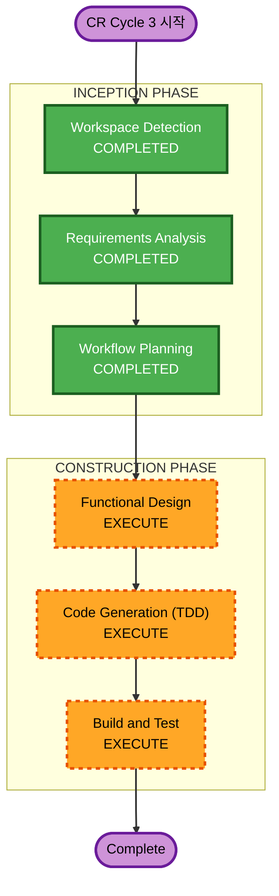

# CR Cycle 3 - Execution Plan

## Detailed Analysis Summary

### Transformation Scope
- **Transformation Type**: Multi-component 변경 (버그 수정 + 기능 삭제 + 콘텐츠 강화 + 성능 최적화)
- **Primary Changes**: CR-05~CR-10 (6건 변경요건)
- **Related Components**: demo/page.tsx, MousePointer.tsx, demoStepGenerator.ts, scenarios.ts, layout.tsx, page.tsx, result 관련 컴포넌트

### Change Impact Assessment
- **User-facing changes**: Yes - 탐색기 버그 수정, 대화 깊이 강화, 결과 품질 강화, 안내 문구 수정, 로딩 속도 개선
- **Structural changes**: Yes - MousePointer 컴포넌트 전체 삭제, 대화 데이터 구조 대폭 확장
- **Data model changes**: No - 기존 DemoStep/ChatMessage 타입 유지
- **API changes**: No - 기존 API 구조 유지
- **NFR impact**: Yes - CR-10 초기 로딩 성능 개선

### Component Relationships
- **Primary Components**: demo/page.tsx, demoStepGenerator.ts, scenarios.ts
- **삭제 대상**: MousePointer.tsx, MousePointerHighlight.test.tsx
- **콘텐츠 강화 대상**: demoStepGenerator.ts (대화), result 탭 컴포넌트들 (산출물)
- **성능 개선 대상**: layout.tsx, page.tsx (폰트/번들 최적화)
- **텍스트 수정 대상**: demoStepGenerator.ts 또는 demo/page.tsx (안내 문구)

### Risk Assessment
- **Risk Level**: Medium
- **Rollback Complexity**: Easy (기존 코드 백업 가능)
- **Testing Complexity**: Moderate (기존 280 tests 회귀 + 신규 테스트)

---

## Workflow Visualization



### Text Alternative
```
Phase 1: INCEPTION
  - Workspace Detection (COMPLETED)
  - Requirements Analysis (COMPLETED)
  - Workflow Planning (COMPLETED)

Phase 2: CONSTRUCTION
  - Functional Design (EXECUTE)
  - Code Generation - TDD (EXECUTE)
  - Build and Test (EXECUTE)
```

---

## Phases to Execute

### INCEPTION PHASE
- [x] Workspace Detection - COMPLETED (Brownfield, RE artifacts exist)
- [x] Requirements Analysis - COMPLETED (CR-05~CR-10 요구사항 정의)
- [x] Workflow Planning - COMPLETED (본 문서)
- [x] User Stories - SKIP
  - **Rationale**: CR 변경요건은 기존 사용자 스토리 범위 내 수정/삭제/강화. 새로운 페르소나나 워크플로우 없음
- [x] Application Design - SKIP
  - **Rationale**: 기존 컴포넌트 경계 내 변경. 새로운 컴포넌트/서비스 불필요 (MousePointer는 삭제만)
- [x] Units Generation - SKIP
  - **Rationale**: 단일 Unit으로 처리 가능. CR 6건 모두 기존 코드베이스 내 수정/삭제/강화

### CONSTRUCTION PHASE
- [ ] Functional Design - EXECUTE
  - **Rationale**: CR-05 버그 근본 원인 분석, CR-07 대화 데이터 구조 설계, CR-08 산출물 콘텐츠 설계, CR-10 성능 원인 분석 필요
- [ ] NFR Requirements - SKIP
  - **Rationale**: CR-10 성능 개선은 Code Generation에서 직접 처리. 별도 NFR 설계 불필요
- [ ] NFR Design - SKIP
  - **Rationale**: NFR Requirements 미실행
- [ ] Infrastructure Design - SKIP
  - **Rationale**: 인프라 변경 없음
- [ ] Code Generation (TDD) - EXECUTE
  - **Rationale**: CR-05~CR-10 전체 구현. TDD RED-GREEN-REFACTOR 사이클
- [ ] Build and Test - EXECUTE
  - **Rationale**: 전체 빌드 검증 + 회귀 테스트

---

## CR별 구현 전략

| CR | 유형 | 복잡도 | 구현 전략 |
|----|------|--------|-----------|
| CR-05 | 버그 수정 | 중간 | handleFileClick + fileContentsMap 로직 근본 수정 |
| CR-06 | 기능 삭제 | 낮음 | MousePointer.tsx 삭제, demo/page.tsx에서 import/사용 제거, 관련 테스트 삭제 |
| CR-07 | 콘텐츠 강화 | 높음 | demoStepGenerator.ts 대화 데이터 대폭 확장 (8개+ 메시지/단계, 하이브리드 방식) |
| CR-08 | 콘텐츠 강화 | 높음 | result 탭 컴포넌트들 Product-Ready 수준 콘텐츠 강화 |
| CR-09 | 텍스트 수정 | 낮음 | 안내 문구 "아래" -> "우측 상단" 변경 |
| CR-10 | 성능 개선 | 중간 | Google Fonts 최적화, dynamic import, 번들 분석 |

## Estimated Timeline
- **Total Stages**: 3 (Functional Design + Code Generation + Build and Test)
- **Estimated Duration**: Functional Design 1회, Code Generation 1 Unit (TDD), Build and Test 1회

## Success Criteria
- **Primary Goal**: CR-05~CR-10 전체 반영
- **Key Deliverables**: 버그 수정, MousePointer 삭제, 대화/산출물 품질 강화, 성능 개선
- **Quality Gates**: 기존 테스트 회귀 없음, next build SUCCESS, Summit 데모 품질
