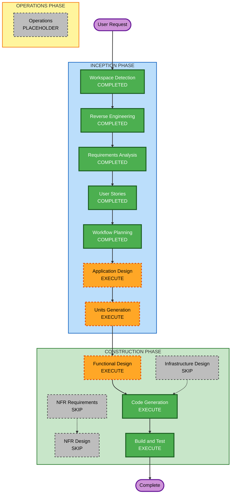

# Execution Plan (Brownfield Enhancement)

## Detailed Analysis Summary

### Transformation Scope
- **Transformation Type**: Multi-component Enhancement (아키텍처 변경 없음, 기존 구조 내 개선/확장)
- **Primary Changes**: Animation 통합, DemoPage 리팩토링, 접근성/성능 개선, 관리자 대시보드/다국어 신규 추가
- **Related Components**: 13+ 기존 파일 수정, 3개 파일 삭제, 7+ 신규 파일 생성

### Change Impact Assessment
- **User-facing changes**: Yes - Animation 통합, 접근성 개선, 다국어 지원, 관리자 대시보드
- **Structural changes**: Yes - DemoPage 리팩토링 (모듈 분리), MVPPreview 분리
- **Data model changes**: No - 기존 타입 유지
- **API changes**: Yes - stream/estimate API 삭제, log API 실제 연동, 에러 응답 통일
- **NFR impact**: Yes - 성능 최적화, 접근성 개선

### Component Relationships
```
Primary Components:
  - src/app/demo/page.tsx (리팩토링 대상)
  - src/components/animation/* (활용 대상)
  - src/app/result/page.tsx (접근성, 다국어, 성능)

Infrastructure Components: 없음 (CDK/Terraform 미사용)

Shared Components:
  - src/contexts/DemoSessionContext.tsx (상태 관리)
  - src/types/* (타입 정의)
  - src/services/LogService.ts (로그 연동)

New Components:
  - src/app/admin/page.tsx (관리자 대시보드)
  - src/i18n/* (다국어)
  - src/utils/scenarioDetector.ts (리팩토링)
  - src/hooks/useDemoProgress.ts (리팩토링)
```

### Risk Assessment
- **Risk Level**: Medium
- **Rollback Complexity**: Moderate (다수 파일 변경이지만 기존 테스트로 검증 가능)
- **Testing Complexity**: Moderate (기존 131개 테스트 + 신규 테스트 필요)

---

## Workflow Visualization



### Text Alternative
```
INCEPTION PHASE (5 completed + 2 to execute):
  Workspace Detection [COMPLETED] -> Reverse Engineering [COMPLETED] -> 
  Requirements Analysis [COMPLETED] -> User Stories [COMPLETED] -> 
  Workflow Planning [COMPLETED] -> Application Design [EXECUTE] -> 
  Units Generation [EXECUTE]

CONSTRUCTION PHASE (3 to execute + 3 skip):
  Functional Design [EXECUTE] -> Code Generation [EXECUTE] -> Build and Test [EXECUTE]
  NFR Requirements [SKIP], NFR Design [SKIP], Infrastructure Design [SKIP]

OPERATIONS PHASE:
  Operations [PLACEHOLDER]
```

---

## Phases to Execute

### INCEPTION PHASE
- [x] Workspace Detection - COMPLETED (2026-03-21)
- [x] Reverse Engineering - COMPLETED (2026-03-21)
- [x] Requirements Analysis - COMPLETED (2026-03-21)
- [x] User Stories - COMPLETED (2026-03-21)
- [x] Workflow Planning - COMPLETED (2026-03-21)
- [ ] Application Design - EXECUTE
  - **Rationale**: 9개 요구사항으로 인해 새로운 컴포넌트(관리자 대시보드, 다국어 시스템), 모듈 분리(DemoPage 리팩토링), Animation 통합 등 컴포넌트 구조 재설계 필요
- [ ] Units Generation - EXECUTE
  - **Rationale**: 40개 User Stories를 효율적으로 구현하기 위해 작업 단위(Unit) 분해 필요. 의존성 순서에 따른 구현 순서 결정 필요

### CONSTRUCTION PHASE
- [ ] Functional Design - EXECUTE
  - **Rationale**: Animation 시퀀스 설계, 다국어 데이터 모델, 관리자 대시보드 데이터 흐름 등 상세 기능 설계 필요
- [ ] NFR Requirements - SKIP
  - **Rationale**: 성능 최적화 요구사항이 REQ-B07에 이미 구체적으로 정의됨. 별도 NFR 분석 불필요
- [ ] NFR Design - SKIP
  - **Rationale**: NFR Requirements 스킵에 따라 자동 스킵. 성능 최적화는 Code Generation에서 직접 구현
- [ ] Infrastructure Design - SKIP
  - **Rationale**: 인프라 변경 없음 (Next.js 단독 배포 유지, CDK/Terraform 미사용)
- [ ] Code Generation - EXECUTE (ALWAYS)
  - **Rationale**: 모든 요구사항의 실제 코드 구현
- [ ] Build and Test - EXECUTE (ALWAYS)
  - **Rationale**: 빌드 검증, 기존 테스트 통과 확인, 신규 테스트 작성

### OPERATIONS PHASE
- [ ] Operations - PLACEHOLDER
  - **Rationale**: 향후 배포/모니터링 워크플로우 (현재 미구현)

---

## Unit Decomposition Preview

9개 요구사항을 의존성 순서에 따라 다음과 같이 Unit으로 분해할 예정:

| Unit | 요구사항 | 의존성 | 우선순위 |
|------|---------|--------|---------|
| Unit 1: 코드 정리 | REQ-B02 (API 삭제), REQ-B03 (리팩토링) | 없음 (기반 작업) | 1st |
| Unit 2: 핵심 기능 | REQ-B01 (Animation), REQ-B06 (에러 핸들링) | Unit 1 (리팩토링 완료 후) | 2nd |
| Unit 3: 품질 개선 | REQ-B04 (접근성), REQ-B07 (성능) | Unit 1 | 3rd |
| Unit 4: 신규 기능 | REQ-B08 (대시보드), REQ-B09 (다국어) | Unit 1 (log 연동) | 4th |
| Unit 5: 마무리 | REQ-B05 (이메일 유지), 통합 테스트 | Unit 1~4 | 5th |

---

## Estimated Timeline
- **Total Stages to Execute**: 5개 (Application Design, Units Generation, Functional Design, Code Generation, Build and Test)
- **Total Stages to Skip**: 4개 (NFR Requirements, NFR Design, Infrastructure Design, Operations)
- **Estimated Duration**: 각 단계별 1~2 상호작용 사이클

## Success Criteria
- **Primary Goal**: 9개 요구사항 모두 구현 완료
- **Key Deliverables**: 리팩토링된 코드, Animation 통합, 접근성 개선, 관리자 대시보드, 다국어 지원
- **Quality Gates**: 기존 131개 테스트 통과 + 신규 테스트 추가, 빌드 성공
