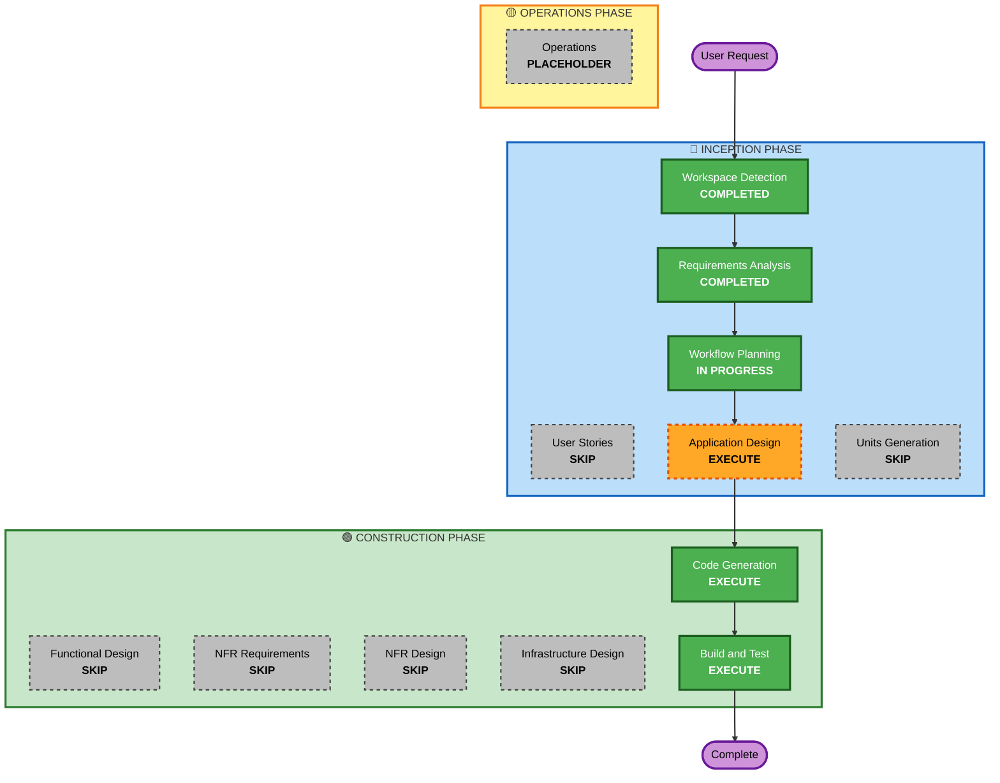

# Execution Plan

## Detailed Analysis Summary

### Project Overview
- **Project Name**: AI-DLC Demo Showcase
- **Project Type**: Greenfield (새 프로젝트)
- **Complexity**: Moderate
- **Risk Level**: Low (데모용 앱, 프로덕션 아님)

### Change Impact Assessment
- **User-facing changes**: Yes - 전체가 새로운 사용자 인터페이스
- **Structural changes**: Yes - 새로운 시스템 아키텍처
- **Data model changes**: Yes - 로깅용 데이터 모델 필요
- **API changes**: Yes - AI 연동 및 로깅 API
- **NFR impact**: Yes - 성능(스트리밍), 안정성(에러 핸들링)

---

## Workflow Visualization



### Text Alternative
```
Phase 1: INCEPTION
- Workspace Detection (COMPLETED)
- Requirements Analysis (COMPLETED)
- User Stories (SKIP)
- Workflow Planning (IN PROGRESS)
- Application Design (EXECUTE)
- Units Generation (SKIP)

Phase 2: CONSTRUCTION
- Functional Design (SKIP)
- NFR Requirements (SKIP)
- NFR Design (SKIP)
- Infrastructure Design (SKIP)
- Code Generation (EXECUTE)
- Build and Test (EXECUTE)

Phase 3: OPERATIONS
- Operations (PLACEHOLDER)
```

---

## Phases to Execute

### 🔵 INCEPTION PHASE
- [x] Workspace Detection - COMPLETED
- [x] Reverse Engineering - SKIPPED (Greenfield)
- [x] Requirements Analysis - COMPLETED
- [ ] User Stories - **SKIP**
  - **Rationale**: 단일 사용자 유형(부스 방문객), 간단한 플로우로 User Stories 불필요
- [x] Workflow Planning - IN PROGRESS
- [ ] Application Design - **EXECUTE**
  - **Rationale**: 컴포넌트 구조 및 서비스 레이어 설계 필요 (Kiro IDE 시뮬레이션, 애니메이션 시스템, AI 연동)
- [ ] Units Generation - **SKIP**
  - **Rationale**: 단일 유닛으로 충분, 복잡한 분해 불필요

### 🟢 CONSTRUCTION PHASE
- [ ] Functional Design - **SKIP**
  - **Rationale**: 복잡한 비즈니스 로직 없음, 요구사항에서 충분히 정의됨
- [ ] NFR Requirements - **SKIP**
  - **Rationale**: 요구사항에 NFR 이미 포함 (성능, 안정성, 사용성)
- [ ] NFR Design - **SKIP**
  - **Rationale**: 기술 스택 이미 결정됨 (Next.js + Tailwind)
- [ ] Infrastructure Design - **SKIP**
  - **Rationale**: Vercel 배포로 인프라 단순화, 별도 설계 불필요
- [ ] Code Generation - **EXECUTE**
  - **Rationale**: 실제 구현 필요
- [ ] Build and Test - **EXECUTE**
  - **Rationale**: 빌드 및 테스트 검증 필요

### 🟡 OPERATIONS PHASE
- [ ] Operations - **PLACEHOLDER**
  - **Rationale**: 향후 배포/모니터링 워크플로우

---

## Estimated Timeline
- **Total Stages to Execute**: 4개 (Workflow Planning, Application Design, Code Generation, Build and Test)
- **Estimated Duration**: 중간 복잡도 프로젝트

## Success Criteria
- **Primary Goal**: AWS Summit 부스에서 AI-DLC 데모 성공적 시연
- **Key Deliverables**:
  - Kiro IDE 시뮬레이션 웹앱
  - 마우스 포인터 애니메이션 시스템
  - AI 연동 스트리밍 응답
  - MVP 미리보기 + AWS 아키텍처 표시
  - 결과 요약 화면
  - 사용자 입력 로깅
- **Quality Gates**:
  - 자동 진행 데모 완료
  - 멀티 세션 동시 지원
  - 터치 친화적 UI
