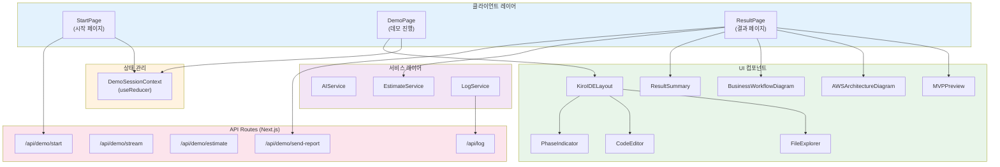

# System Architecture

## System Overview

AI-DLC Demo Showcase는 Next.js 14 App Router 기반의 풀스택 모놀리식 웹 애플리케이션이다. 클라이언트 사이드 렌더링(CSR)을 주로 사용하며, API Routes를 통해 서버 사이드 로직을 처리한다. 상태 관리는 React Context + useReducer 패턴을 사용하고, 애니메이션은 Framer Motion을 활용한다.

## Architecture Diagram



### Text Alternative
```
Client Layer:
  StartPage -> DemoSessionContext -> DemoPage -> KiroIDELayout
  DemoPage -> ResultPage

KiroIDELayout contains:
  FileExplorer, CodeEditor, PhaseIndicator, ChatPanel

ResultPage contains:
  MVPPreview, AWSArchitectureDiagram, BusinessWorkflowDiagram, ResultSummary

API Routes:
  /api/demo/start, /api/demo/stream, /api/demo/estimate, /api/demo/send-report, /api/log

Services:
  AIService -> /api/demo/stream
  EstimateService (client-side calculation)
  LogService -> /api/log
```

## Component Descriptions

### Pages
| Component | Purpose | Dependencies | Type |
|-----------|---------|-------------|------|
| StartPage (`src/app/page.tsx`) | 프로젝트 아이디어 입력 및 데모 시작 | DemoSessionContext, next/navigation, framer-motion | Application |
| DemoPage (`src/app/demo/page.tsx`) | AI-DLC 7단계 시뮬레이션 진행 | DemoSessionContext, KiroIDELayout | Application |
| ResultPage (`src/app/result/page.tsx`) | 결과 조회 (6개 탭) | MVPPreview, AWSArchitectureDiagram, BusinessWorkflowDiagram, EstimateService | Application |

### Kiro IDE Components
| Component | Purpose | Dependencies | Type |
|-----------|---------|-------------|------|
| KiroIDELayout | Kiro IDE 전체 레이아웃 (타이틀바, 파일탐색기, 에디터, 채팅) | FileExplorer, PhaseIndicator, framer-motion | UI |
| FileExplorer | 파일 트리 탐색기 | FileTreeNode type, framer-motion | UI |
| CodeEditor | 코드/마크다운 에디터 (타이핑 효과) | - | UI |
| PhaseIndicator | AI-DLC 진행 상태 표시 바 | DemoSessionContext | UI |

### Result UI Components
| Component | Purpose | Dependencies | Type |
|-----------|---------|-------------|------|
| MVPPreview | 산업별 MVP UI 미리보기 (사용자/관리자 페르소나) | framer-motion | UI |
| AWSArchitectureDiagram | 산업별 AWS 아키텍처 Mermaid 다이어그램 | mermaid, framer-motion | UI |
| BusinessWorkflowDiagram | 시퀀스 다이어그램 (SVG) | framer-motion | UI |
| ResultSummary | 결과 요약 및 QR 코드 | qrcode.react | UI |

## Data Flow

```
1. 사용자 입력 흐름:
   StartPage -> setProjectIdea -> initSession(DemoSessionContext) -> router.push(/demo?idea=...)

2. 데모 진행 흐름:
   DemoPage -> detectScenario(idea) -> generateDemoSteps(idea)
   -> runStep(stepIndex) -> 채팅 메시지 + 파일 생성 시뮬레이션
   -> "다음 단계" 버튼 클릭 -> 다음 runStep

3. 결과 조회 흐름:
   DemoPage 완료 -> router.push(/result?idea=...)
   -> ResultPage -> calculateEstimate(idea) -> 6개 탭 렌더링

4. 이메일 리포트 흐름:
   ResultPage -> EmailReportModal -> POST /api/demo/send-report
```

### 페이지 간 네비게이션 및 데이터 전달

| From | To | Method | Data |
|------|----|--------|------|
| StartPage | DemoPage | `router.push('/demo?idea=...')` | URL query param `idea` |
| DemoPage | ResultPage | `router.push('/result?idea=...')` | URL query param `idea` |
| DemoPage | StartPage | `router.push('/')` | 없음 |
| ResultPage | StartPage | `router.push('/')` | 없음 |
| ResultPage | DemoPage | `router.back()` | 브라우저 히스토리 |

**참고**: DemoSessionContext는 전역 상태이지만, 실제 페이지 간 데이터 전달은 URL query parameter(`idea`)를 통해 이루어짐. ResultPage는 Context를 사용하지 않고 `searchParams.get('idea')`로 직접 아이디어를 가져와 EstimateService를 호출함.

### DemoPage 내부 핵심 흐름

```
useEffect (첫 진입)
  |
  v
runStep(0)
  |
  +-> runIdRef 증가 (취소 메커니즘)
  +-> setIsAnimating(true)
  +-> 이전 단계 채팅 메시지 복원
  +-> setPhase/setStage (Context 업데이트)
  +-> for each chatSequence message:
  |     +-> AI 메시지: setIsTyping(true) -> delay(800ms) -> setIsTyping(false)
  |     +-> User 메시지: delay(400ms)
  |     +-> System 메시지: delay(200ms)
  |     +-> 메시지 추가 -> setChatMessages
  +-> addFile (Context에 파일 추가)
  +-> setActiveFile + setEditorContent
  +-> fileContentsMap 업데이트 (파일 클릭 시 재표시용)
  +-> setProgress (PhaseIndicator 업데이트)
  +-> 완료 안내 시스템 메시지 추가
  +-> setIsAnimating(false), setStepCompleted(true)
  |
  v
"다음 단계" 버튼 클릭 -> handleNextStep -> runStep(n+1)
"이전 단계" 버튼 클릭 -> handlePrevStep -> runStep(n-1)
마지막 단계 "결과 보기" -> router.push(/result?idea=...)
```

## Integration Points

- **External APIs**: 없음 (모든 데이터는 클라이언트 사이드에서 생성)
- **Databases**: 없음 (In-memory 로그 저장만 사용)
- **Third-party Services**: 없음 (데모용으로 이메일 전송은 로그만 기록)
- **CDN**: Mermaid.js (동적 import)

## Infrastructure Components

- **CDK Stacks**: 없음
- **Deployment Model**: Next.js 단독 배포 (Vercel 또는 자체 서버)
- **Networking**: 단일 서버, 별도 VPC/서브넷 불필요
